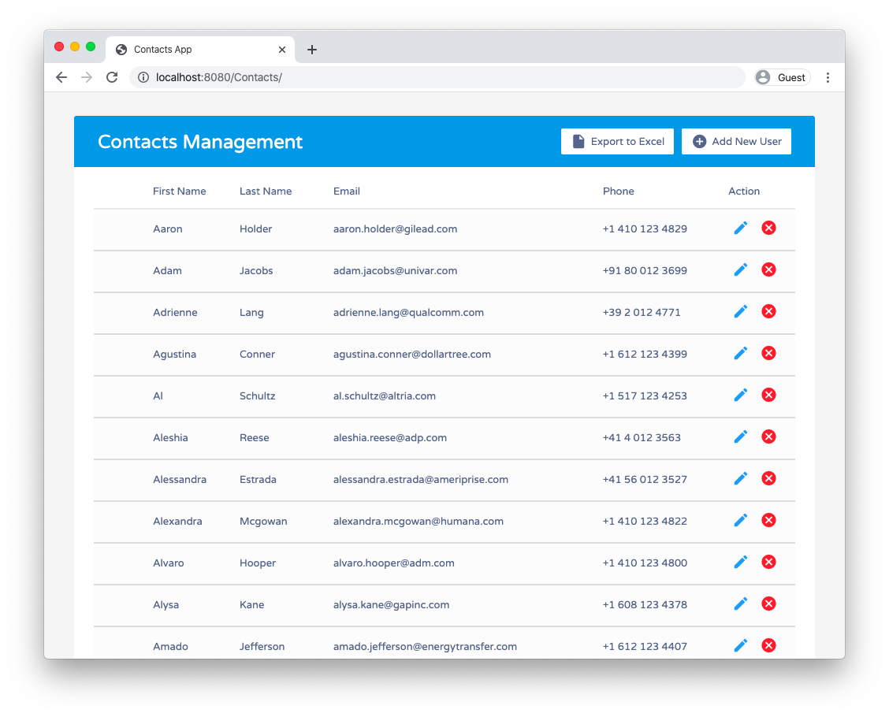
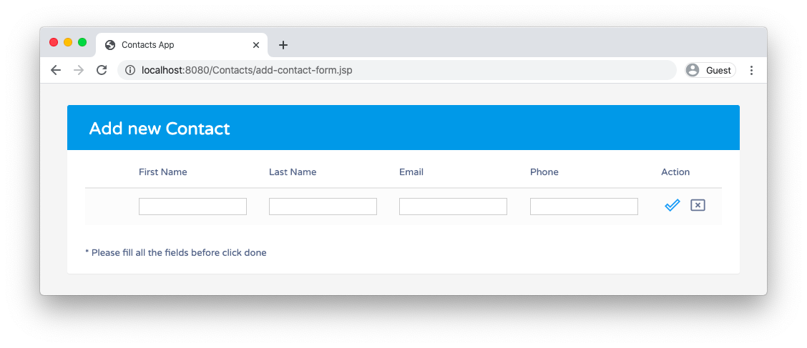

# Contacts Management (CRUD App)
 
## Features

+ Java Servlets and Java Server Pages (JSP)
+ JSP Standard Tag Library (JSTL)
+ Java Database Connectivity (JDBC)
+ MySQL database
+ Apache Tomcat Server
+ CURD operations - Create, Update, Read and Delete

## Project requirements

+ Java 8
+ Apache Tomcat 9.0
+ MySQL Server Workbench
+ Eclipse

## Project Setup

1. Run SQL scripts files in MySQL Workbench (scripts located in 'sql-scripts' folder)

2. Import the Project into Eclipse IDE for Java EE Developers 

3. [Adding Server Runtime.](https://www.codejava.net/servers/tomcat/how-to-add-tomcat-server-in-eclipse-ide) Please make sure you select the Apache Tomcatv9.0 as your server. Since the minimum requirement for this Project is v9 or above. The example provided in the link refers to earlier version.

      After all the above steps, the compilation errors will be vanished and you are ready to run the application.

5. To run the application right click the project Select Run As -> Run on Server.

6. Open your browser and type http://localhost:8080/Contacts/

## Example

